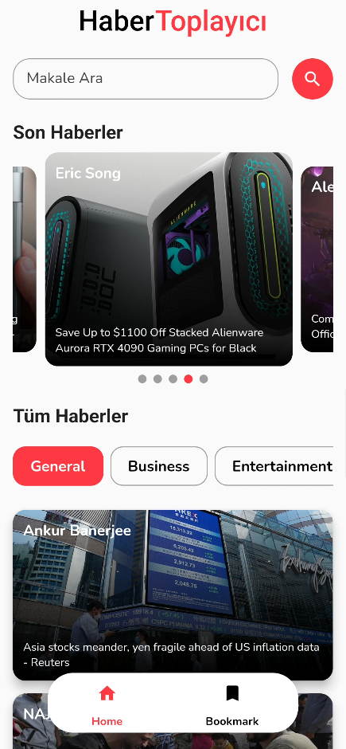

# Haber Toplayıcı

Haber Toplayıcı is a Flutter app that allows users to conveniently gather and explore the latest news from various sources using the NewsAPI.org API. Stay informed with the latest headlines, articles, and updates in a user-friendly interface.

## Features

- **Latest News**: Retrieve up-to-date news articles from various sources.
- **Search Functionality**: Search for specific topics or keywords to find relevant news.
- **Detailed Articles**: Read detailed articles with images and descriptions.
- **Bookmark Articles**: Save your favorite articles to read later.

## Screenshots


*News Aggregator Main Page*


*News Aggregator Search Page*

## Getting Started

To get started with Haber Toplayıcı, follow these steps:

1. **Clone the Repository:**
   ```bash
   git clone https://github.com/Raderne/News-App-flutter.git
   ```

2. **Install Dependencies:**
   ```bash
   flutter pub get
   ```

3. **Run the App:**
   ```bash
   flutter run
   ```

Make sure you have Flutter installed on your machine. If not, follow the [official Flutter installation guide](https://flutter.dev/docs/get-started/install).

## Configuration

1. **Obtain NewsAPI.org API Key:**
   - Visit [NewsAPI.org](https://newsapi.org/) and sign up for an API key.
   - Replace the placeholder API key in the `lib/utils/api_constants.dart` file with your actual API key.

   ```dart
   static const String apiKey = 'YOUR_API_KEY';
   ```

2. **Run the App:**
   ```bash
   flutter run
   ```

## Contributing

Contributions are welcome! If you find a bug or have a feature suggestion, please open an issue. Pull requests are also appreciated.

## License

This project is licensed under the MIT License - see the [LICENSE](LICENSE) file for details.